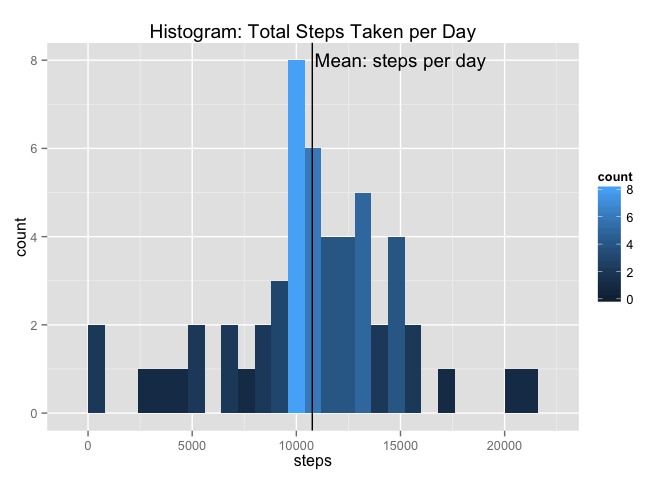
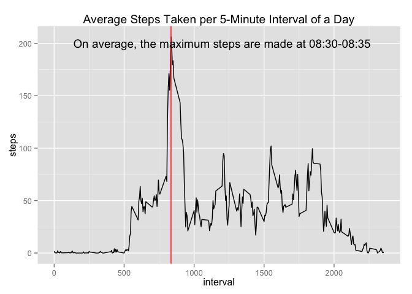
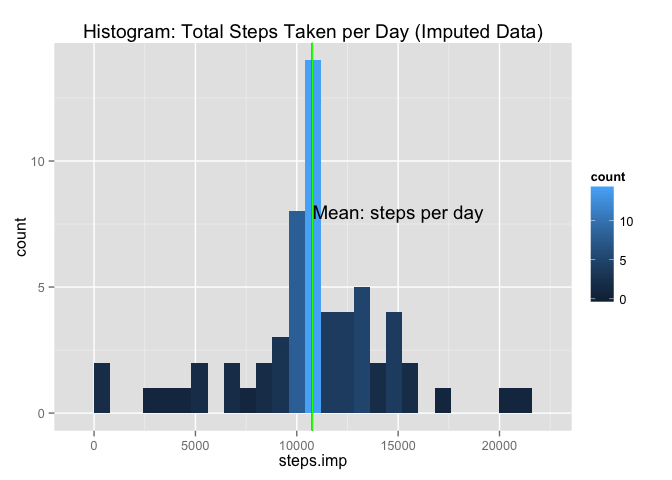

# Reproducible Research: Peer Assessment 1


## Loading and preprocessing the data
Install the ProjectTemplate package and set up a new project.


```r
library ("ProjectTemplate")
create.project ("RepResPA1")
setwd("~/Documents/Disk D/Coursera/RepResearch/RepData_PeerAssessment1/RepResPA1")
```

After copying the activity data into the "data" subfolder, 
Run the load.project() function to automatically read the data file into memory.

```r
library ("ProjectTemplate")
load.project()
```

```
## Loading project configuration
## Autoloading helper functions
##  Running helper script: helpers.R
## Autoloading cache
## Autoloading data
##  Loading data set: activity
## Munging data
##  Running preprocessing script: 01-A.R
```

```r
library("ggplot2")
```

Now the data is loaded and ready for the analysis.

## What is mean total number of steps taken per day?

Notice: For this part of the assignment, the missing values were ignored.

First, we calculate the total and average number of steps measured per day, which is illustrated by the histogram below.


```r
stepsDay = aggregate (steps ~ date, data = activity, FUN = sum)
m = ggplot(stepsDay, aes(x=steps)) +
  geom_histogram(binwidth = 800, aes(fill = ..count..)) + 
  labs(title = "Histogram: Total Steps Taken per Day") + 
  geom_vline(xintercept = mean(stepsDay$steps)) + 
  annotate("text", x = 15000, y = 8, label = "Mean: steps per day")
m
```

 

The mean and the median number of steps taken per day are very close to each other at 10.760 and 10.770 steps respectively.


```r
summary(stepsDay$steps)
```

```
##    Min. 1st Qu.  Median    Mean 3rd Qu.    Max. 
##      41    8841   10760   10770   13290   21190
```


## What is the average daily activity pattern?

The average daily activity pattern can be analyzed by looking at the average number of steps measured in each of the 5 minute interval of a day (the NA values were ignored).


```r
stepsMin = aggregate (steps ~ interval, data = activity, FUN = mean)
p = ggplot(stepsMin, aes(x= interval, y = steps))
p + geom_line() + labs(title = "Average Steps Taken per 5-Minute Interval of a Day") + geom_vline(xintercept = 835, colour = "red") + annotate("text", x = 1200, y = 200, label = "On average, the maximum steps are made at 08:30-08:35")
```

 

It is visible that the test subject was not walking at night and made the most steps per 5 minutes in the intervals between 750 and 1000. More precisely, the average maximum number of steps per 5 minutes is 206, and it happened in the interval 835 which corresponds to 08:30-08:35 in the morning.


```r
stepsMin [stepsMin$steps == max(stepsMin$steps),]
```

```
##     interval    steps
## 104      835 206.1698
```

## Imputing missing values

There are a number of days/intervals in the data where the measurements are missing. 
Overall, there are 2304 intervals with missing values in the dataset.

```r
ok = complete.cases(activity)
# get the sum of the cases that are not complete
sum(!ok)
```

```
## [1] 2304
```

This missing values in each 5-minute interval can be imputed using the average count of steps for the respective 5-minute interval. As the averages were previously calculated ignoring these missing timeframes, this should be a reasonable way to fill the gaps. A more sophisticated approach would include differences between weekdays, as human activity usually follows not only daily, but also weekly cyclical patterns.


```r
#create a new dataframe where the average steps are assigned to each of the 5-min intervals in the colum steps.avg
library(plyr)
actImp = join (activity, stepsMin, by = "interval")
names(actImp) [4] = "steps.avg"
# create a new variable that gets average step count if the measurement is NA, otherwise
# it gets the original measured count of steps.
actImp$steps.imp = ifelse(is.na(actImp$steps), actImp$steps.avg, actImp$steps)
```

Now that imputed dataset has been created, the initial analysis of the average daily steps count can be repeated.


```r
stepsImpDay = aggregate (steps.imp ~ date, data = actImp, FUN = sum)
n = ggplot(stepsImpDay, aes(x=steps.imp)) +
  geom_histogram(binwidth = 800, aes(fill = ..count..)) + 
  labs(title = "Histogram: Total Steps Taken per Day (Imputed Data)") + 
  geom_vline(xintercept = mean(stepsImpDay$steps.imp)) + 
  geom_vline(xintercept = mean(stepsImpDay$steps.imp), color = "green") + 
  annotate("text", x = 15000, y = 8, label = "Mean: steps per day")
n
```

 
  
  As a result of imputing data, not much has changed. Just the summary statistic shows a shift of the median towards the mean and that the quantile borders have changed slightly.


```r
summary(stepsImpDay$steps.imp)
```

```
##    Min. 1st Qu.  Median    Mean 3rd Qu.    Max. 
##      41    9819   10770   10770   12810   21190
```

## Are there differences in activity patterns between weekdays and weekends?

In order to answer this question, the date variable is converted to a factor with two levels, "weekend" and "weekday".

```r
library(lubridate)
```

```
## 
## Attaching package: 'lubridate'
## 
## The following object is masked from 'package:plyr':
## 
##     here
```

```r
# create new variable 'wday' with weekdays extracted from the date, then replace the 
# weekday numbers with levels and convert to a factor variable
actImp$wday = wday(actImp$date)
actImp$wday = gsub("[2-6]", "weekday", actImp$wday)
actImp$wday = gsub("[1]", "weekend", actImp$wday)
actImp$wday = gsub("[7]", "weekend", actImp$wday)
actImp$wday = as.factor(actImp$wday)
str(actImp$wday)
```

```
##  Factor w/ 2 levels "weekday","weekend": 1 1 1 1 1 1 1 1 1 1 ...
```

Now the average counts per 5-min interval can be analylzed based on this factor.


```r
stepsImpMin = aggregate (steps.imp ~ interval, data = actImp, FUN = mean)
names(stepsImpMin) [2] = "w_day"
stepsImpMin$steps.imp = as.numeric(stepsImpMin$steps.imp)
# there is a problem with knitr that prevents it from generating the chart so 
# I had to comment it out. The code works in RStudio and displays the chart.

# library("lattice")
# xyplot(steps.imp ~ interval|w_day, data = stepsImpMin, type = "l")
```
Now it is visible that on weekdays the activity of the test subject has started earlier in the morning and finished earlier in the evening. In the morning, more steps were taken on average. On weekends, the test subject has made less steps in the intervals up to 10:00 o'clock and has moved more actively after 20:00 o'clock.
